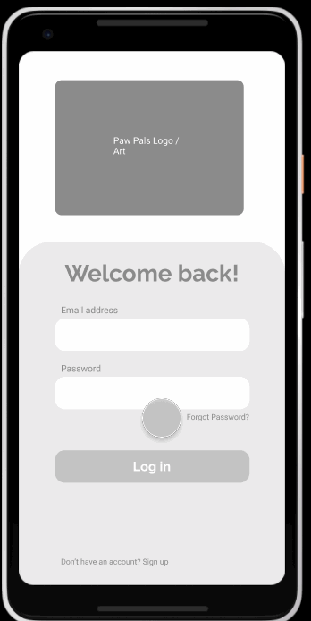

# PawPals

## Table of Contents
1. [Overview](#Overview)
1. [Product Spec](#Product-Spec)
1. [Wireframes](#Wireframes)
2. [Schema](#Schema)

## Overview
### Description
Allows dog owners to connect and schedule time to take their dogs to go to parks and meet up for play dates.

### App Evaluation
- **Category:** Social, Lifestyle
- **Mobile:** GPS, Camera
- **Story:** Creates connections between dog owners. Allows for dogs and their owners to meet and have fun social interactions safely, with other dogs that match well in the same area.
- **Market:** Dog owners who want to socialize over their pets.
- **Habit:** Dog owners can be notified a few times a week to take their dogs out for longer trips / to parks to socialize. User can be more engaged if there is a timeline to add pictures.
- **Scope:** MVP would consist of:
    User able to build profiles for dogs
    User would be able to find profiles of other dogs nearby
    User would be able to schedule with / message other dog owners
    (Opt) Timeline

## Product Spec

### 1. User Stories (Required and Optional)

**Required Must-have Stories**

* User can create an account and login
* User can create profiles for each of their dogs attached to their account
* User can use their GPS location to explore the local area and find other dog owners
* User can view local dog owner profiles
* User can send messages to other dog owners and schedule playdates

**Optional Nice-to-have Stories**

* User can also find nearby parks in the explore screen
* User can post pictures to their dog's timeline and engage with other dogs' timelines
* User can receive push notifications a few times a week to take their dogs for longer walks / trips to a park to socialize.

### 2. Screen Archetypes

* Launch screen
   * This screen welcomes the user when opening the app for the first time.
* Login screen
   * If user has an account, this screen allows for logging in. 
   * (Opt) If the user has logged into an account previously, this screen is opened upon launch.
* Register screen
   * If user does not have an account, this screen allows for creating one.
* Messaging screen
   * This screen allows the user to communicate with other users (1-on-1).
* User (owner) profile screen
   * This screen shows the user profile picture and the user's pets.
* Pet profile screen
   * This screen shows the pet profile picture and profile details.
* Explore screen
   * This screen shows a map of the local area and pins for locations of parks, landmarks, and nearby pets.
* (Opt) Timeline screen
   * This screen can show recent posts added in the local area.

### 3. Navigation

**Tab Navigation** (Tab to Screen)

* (Opt) Timeline
* Explore
* Profile
* Messaging

**Flow Navigation** (Screen to Screen)

* Launch screen -> 
   * Create account -> Profile
   * Log in -> Profile
* (Opt) Timeline ->
   * Post details -> Post user's profile
   * Post user's profile
* Explore
* Profile ->
   * Add/edit pet
   * Pet profile
* Messaging -> Message detail

## Wireframes

### [BONUS] Digital Wireframes & Mockups

### [BONUS] Interactive Prototype

## Schema 
[This section will be completed in Unit 9]
### Models
[Add table of models]
### Networking
- [Add list of network requests by screen ]
- [Create basic snippets for each Parse network request]
- [OPTIONAL: List endpoints if using existing API such as Yelp]
