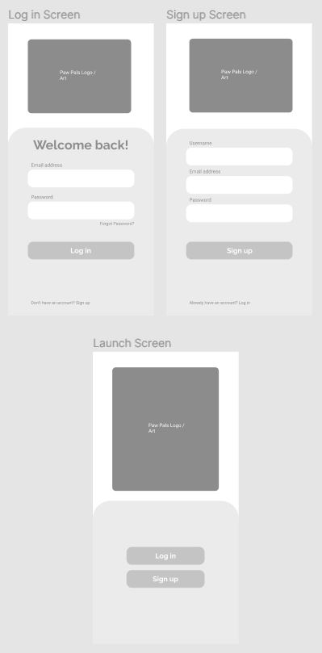
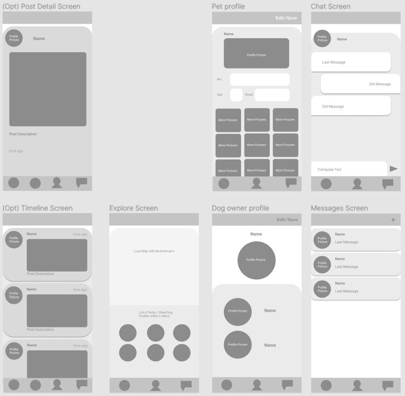
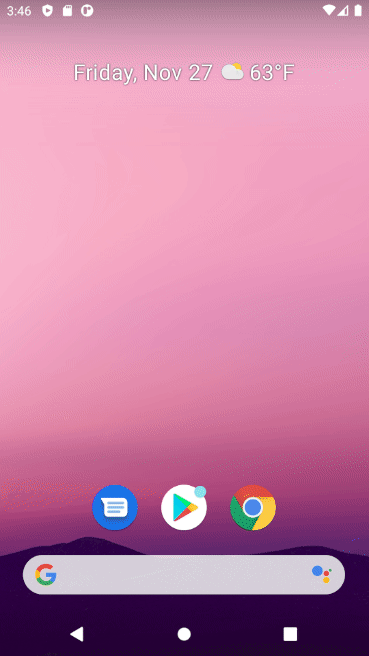

# PawPals

## Table of Contents
1. [Overview](#Overview)
2. [Product Spec](#Product-Spec)
3. [Wireframes](#Wireframes)
4. [Schema](#Schema)
5. [Progress](#Progress)

## Overview
### Description
Allows dog owners to connect and schedule time to take their dogs to go to parks and meet up for play dates.

### App Evaluation
- **Category:** Social, Lifestyle
- **Mobile:** GPS, Camera
- **Story:** Creates connections between dog owners. Allows for dogs and their owners to meet and have fun social interactions safely, with other dogs that match well in the same area.
- **Market:** Dog owners who want to socialize over their pets.
- **Habit:** Dog owners can be notified a few times a week to take their dogs out for longer trips / to parks to socialize. User can be more engaged if there is a timeline to add pictures.
- **Scope:** MVP would consist of:
    User able to build profiles for dogs
    User would be able to find profiles of other dogs nearby
    User would be able to schedule with / message other dog owners
    (Opt) Timeline

## Product Spec

### 1. User Stories (Required and Optional)

**Required Must-have Stories**

* [x] User can create an account and login
* [ ] User can create profiles for each of their dogs attached to their account
* [ ] User can use their GPS location to explore the local area and find other dog owners
* [ ] User can view local dog owner profiles
* [ ] User can send messages to other dog owners and schedule playdates

**Optional Nice-to-have Stories**

* [ ] User can also find nearby parks in the explore screen
* [ ] User can post pictures to their dog's timeline and engage with other dogs' timelines
* [ ] User can receive push notifications a few times a week to take their dogs for longer walks / trips to a park to socialize.

### 2. Screen Archetypes

* Launch screen
   * This screen welcomes the user when opening the app for the first time.
* Login screen
   * If user has an account, this screen allows for logging in. 
   * (Opt) If the user has logged into an account previously, this screen is opened upon launch.
* Register screen
   * If user does not have an account, this screen allows for creating one.
* Messaging screen
   * This screen allows the user to communicate with other users (1-on-1).
* User (owner) profile screen
   * This screen shows the user profile picture and the user's pets.
* Pet profile screen
   * This screen shows the pet profile picture and profile details.
* Explore screen
   * This screen shows a map of the local area and pins for locations of parks, landmarks, and nearby pets.
* (Opt) Timeline screen
   * This screen can show recent posts added in the local area.

### 3. Navigation

**Tab Navigation** (Tab to Screen)

* (Opt) Timeline
* Explore
* Profile
* Messaging

**Flow Navigation** (Screen to Screen)

* Launch screen -> 
   * Create account -> Profile
   * Log in -> Profile
* (Opt) Timeline ->
   * Post details -> Post user's profile
   * Post user's profile
* Explore
* Profile ->
   * Add/edit pet
   * Pet profile
* Messaging -> Message detail

## Wireframes

### [BONUS] Digital Wireframes & Mockups

### [BONUS] Interactive Prototype

## Schema 

### Models

**User**
|    Property    |    Type                    |          Description                                   |
|    --------    |    ----                    |          -----------                                   |
| objectId       | String                     | unique id for the user (default)                       |
| email          | String                     | user email                                             |
| password       | String                     | user password                                          |
| username       | String                     | user username / display name                           |
| createdAt      | DateTime                   | date when the post is created (default)                |
| friends        | Array (of Pointer to User) | list of friends of user                                |
| profileImage   | File                       | profile image url                                      |
| createdAt      | DateTime                   | date when the user profile is created (default)        |
| updatedAt      | DateTime                   | date when the user was last updated (default)          |

**Pet**
|    Property    |    Type         |          Description                                   |
|    --------    |    ----         |          -----------                                   |
| objectId       | String          | unique id for the pet (default)                        |
| owner          | Pointer to User | pet owner                                              |
| name           | String          | pet name                                               |
| breed          | String          | pet breed                                              |
| age            | String          | pet age                                                |
| gender         | String          | pet gender                                             |
| bio            | String          | description about pet                                  |
| petImage       | File            | pet profile image url                                  |
| createdAt      | DateTime        | date when the pet profile is created (default)         |
| updatedAt      | DateTime        | date when the pet is last updated (default)            |

**Post**
|    Property    |    Type                   |          Description                                   |
|    --------    |    ----                   |          -----------                                   |
| objectId       | String                    | unique id for the post (default)                       |
| author         | Pointer to User           | image author                                           |
| pets           | Array (of Pointer to Pet) | list of pets in image tagged by author                 |
| image          | File                      | image that user posts                                  |
| caption        | String                    | image caption by author                                |
| commentCount   | Number                    | number of comments on the post                         |
| likeCount      | Number                    | number of likes for the post                           |
| createdAt      | DateTime                  | date when the post is created (default)                |
| updatedAt      | DateTime                  | date when the post is last updated (default)           |

**Comment**
|    Property    |    Type            |          Description                                   |
|    --------    |    ----            |          -----------                                   |
| objectId       | String             | unique id for the post (default)                       |
| author         | Pointer to User    | comment author                                         |
| post           | Pointer to Post    | post that comment refers to                            |
| parentId       | Pointer to Comment | unique id of the parent comment                        |
| text           | String             | the comment's text                                     |
| likeCount      | Number             | number of likes for the post                           |
| createdAt      | DateTime           | date when the comment is created (default)             |
| updatedAt      | DateTime           | date when the comment is last updated (default)        |

**Message**
|    Property    |    Type         |          Description                                   |
|    --------    |    ----         |          -----------                                   |
| objectId       | String          | unique id for the message (default)                    |
| author         | Pointer to User | message author                                         |
| recipient      | Pointer to User | message recipient                                      |
| text           | String          | the message's contents                                 |
| createdAt      | DateTime        | date when the message is created (default)             |
| updatedAt      | DateTime        | date when the message is last updated (default)        |

### Networking

**List of network requests by screen**
* Launch screen
* Login screen
* Register screen
   * (Create/POST) Create a new user 
* Messaging screen
   * (Create/POST) Create a new message thread
   * (Read/GET) Query all message threads where user is an author or recipient
   * (Delete) Delete a message thread
* Message detail screen
   * (Create/POST) Create a new message
   * (Read/GET) Query all messages in thread
   * (Update/PUT) Update an existing message
   * (Delete) Delete an existing message
* User (owner) profile screen
   * (Create/POST) Add a new pet
   * (Read/GET) Query all pets where user is owner
   * (Update/PUT) Update user details
   * (Delete) Delete an existing pet
* Pet profile screen
   * (Create/POST) Create a new post (pet tagged automatically?)
   * (Read/GET) Query all posts where pet is tagged
   * (Update/PUT) Update/edit existing post where user is author
   * (Delete) Delete existing post
* Explore screen
   * (Read/GET) Query all local dog parks
   * (Read/GET) Query all nearby users/pets
* (Opt) Timeline screen
   * (Read/GET) Query all posts in user's local area
   * (Create/POST) Create a new like on a post
   * (Delete) Delete existing like
* (Opt) Post detail screen
   * (Create/POST) Create a new like on the post
   * (Delete) Delete existing like
   * (Create/POST) Create a new comment on the post
   * (Update/PUT) Update/edit an existing comment
   * (Delete) Delete existing comment
   
**Google Maps API**
https://guides.codepath.com/android/Google-Maps-Fragment-Guide

## Progress
### Sprint 1

